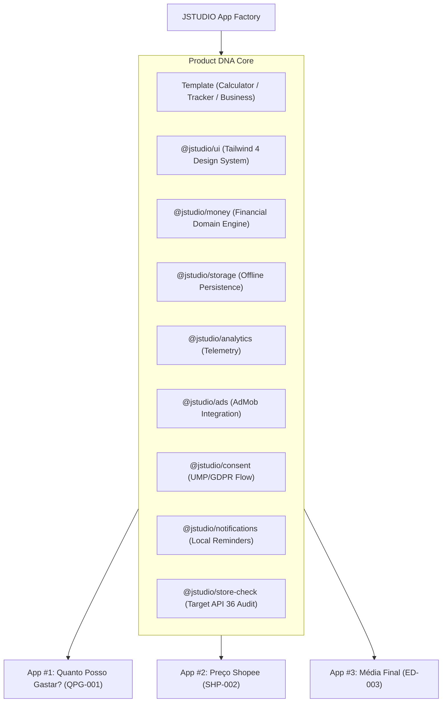

# 🏗️ Arquitetura do JSTUDIO App Factory

## Visão Geral

O **JSTUDIO App Factory** não foi desenhado para gerenciar codebases isoladas, mas sim como uma linha de montagem unificada baseada no conceito de **Product DNA** e **Pacotes Compartilhados**.

---

## 🧬 Conceito: Product DNA

Cada microproduto gerado pela fábrica herda as seguintes capacidades padronizadas:

1. **Domain Engine**: Módulos puros em TypeScript para cálculos sem acoplamento com UI.
2. **Infrastructure**: Armazenamento em preferências locais, notificações locais e consentimento UMP.
3. **Design System**: Componentes reutilizáveis React 19 com Tailwind CSS 4 em modo escuro por padrão.
4. **Monetização**: Banners AdMob configuráveis para teste e produção.
5. **Quality Gate**: Script de validação que impede a publicação de aplicativos que não sigam as regras da Google Play (como Target SDK < 36).

---

## 📉 Redução do Custo por App (Factory Efficiency)

| Produto | Esforço Relativo | Descrição |
| :--- | :--- | :--- |
| **App #1** (`quanto-posso-gastar`) | 100% do esforço | Criação da base monorepo, extração dos pacotes e primeiro produto |
| **App #2** (`preco-shopee`) | ~60% do esforço | Reuso de `@jstudio/ui`, `@jstudio/storage`, `@jstudio/ads` e scaffolding do template |
| **App #10** | ~25% do esforço | Geração rápida a partir de templates validados |
| **App #50** | ~10% do esforço | Linha de produção automatizada via CLI |
