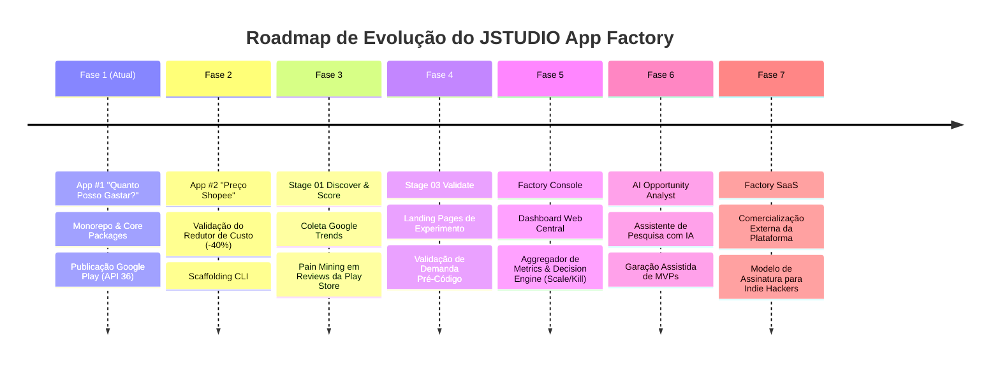

# 🗺️ JSTUDIO App Factory — Roadmap Estratégico

> **Slogan**: *Descubra. Construa. Meça. Escale.*  
> **Métrica Core**: Redução contínua do custo e tempo de construção do próximo produto digital.

---

## 📌 Visão Geral das Fases

---

## 🎯 Detalhamento das Fases

### 🚀 FASE 1 — Fundação & Publicação do App #1 (STATUS: CONCLUÍDO NO MONOREPO ✅)
- [x] Monorepo `pnpm` + `Turborepo` configurado com React 19 + Tailwind 4 + Capacitor 8.
- [x] 8 Pacotes compartilhados criados (`@jstudio/money`, `storage`, `ui`, `analytics`, `ads`, `consent`, `notifications`, `store-check`).
- [x] App #1 "Quanto Posso Gastar?" (Product ID: `QPG-001`) totalmente funcional e testado.
- [x] CLI de qualidade `pnpm factory check` ativo com garantia de **Target SDK 36**.
- [ ] **Próxima Ação**: Gerar arquivo AAB assinado e submeter na Google Play Store via Google Play Console (textos em `docs/STORE_LISTING_QPG.md`).

---

### 🏭 FASE 2 — App #2 "Preço Shopee" & Prova de Eficiência (Q4 2026)
- **Meta Primária**: Validar a redução de tempo/esforço na criação do segundo aplicativo (Meta: 40% de redução de horas em relação ao App #1).
- **Ações**:
  1. Rodar `pnpm factory new-app preco-shopee`.
  2. Implementar o motor de domínio de taxas e margens do marketplace.
  3. Reutilizar 100% da infraestrutura de UI, Storage, AdMob, Analytics e Consentimento.
  4. Publicar na Google Play Store.

---

### 🔍 FASE 3 — Stage 01 Discover & Stage 02 Score (Q1 2027)
- **Meta Primária**: Substituir suposições por evidências numéricas antes de escolher a próxima ideia.
- **Módulos a Implementar**:
  1. **Trends Evidence**: Integração automatizada com dados de tendência e sazonalidade do Google Trends no Brasil.
  2. **Play Store Review Pain Mining**: Script de extração de dores e insatisfações em comentários de apps concorrentes (*"falta...", "não funciona offline...", "muito complicado..."*).
  3. **Opportunity Score Engine**: Cálculo dinâmico da pontuação 0-100 baseada em Demanda, Concorrência, Monetização e Nível de Confiança da evidência.

---

### 🧪 FASE 4 — Stage 03 Validate (Q2 2027)
- **Meta Primária**: Medir intenção real de uso antes de escrever código nativo.
- **Módulos a Implementar**:
  1. Gerador automatizado de micro-landing pages de validação com mockups e chamada para ação (CTA).
  2. Métricas de conversão (% de interessados por 1.000 visitantes).
  3. Regra de corte: Apenas ideias com conversão > 15% avançam para a fase de BUILD.

---

### 📊 FASE 5 — Factory Console & Decision Engine (Q3 2027)
- **Meta Primária**: Centralizar o controle da linha de produção em um painel web interativo.
- **Módulos a Implementar**:
  1. **Pipeline Visual**: `DISCOVER → VALIDATE → BUILD → LAUNCH → GROW`.
  2. **Analytics Aggregator**: Painel consolidado com instalações, retenção (DAU/WAU), receita de anúncios e estabilidade do portfólio.
  3. **Decision Engine aos 60/90 dias**:
     - 🟢 **SCALE**: Alta retenção, receita crescente.
     - 🟡 **OPTIMIZE**: Boa demanda, baixa conversão.
     - 🔵 **NICHE**: Mercado pequeno, porém altamente lucrativo.
     - 🔴 **KILL**: Baixa demanda e baixa retenção (descontinuar).

---

### 🤖 FASE 6 — AI Product Analyst & Scaffolding (Q4 2027)
- **Meta Primária**: Acelerar a pesquisa e a preparação do MVP com inteligência artificial.
- **Módulos a Implementar**:
  1. Agente de IA para varredura contínua de nichos de mercado e geração de relatórios de oportunidade.
  2. Automação de criação de descrições ASO, ícones e assets de loja.

---

### 💼 FASE 7 — JSTUDIO App Factory SaaS (Futuro)
- **Meta Primária**: Comercializar o sistema da fábrica para indie hackers, agências e criadores de microapps.
- **Modelo de Negócio**: Assinatura SaaS mensal (Free / Pro / Factory / Agency).
